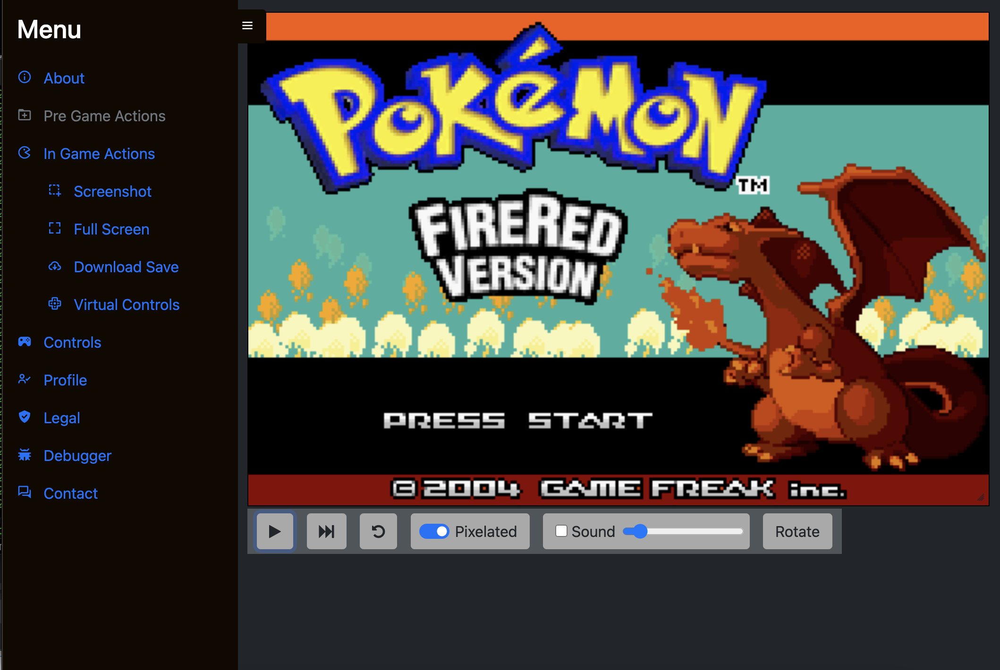
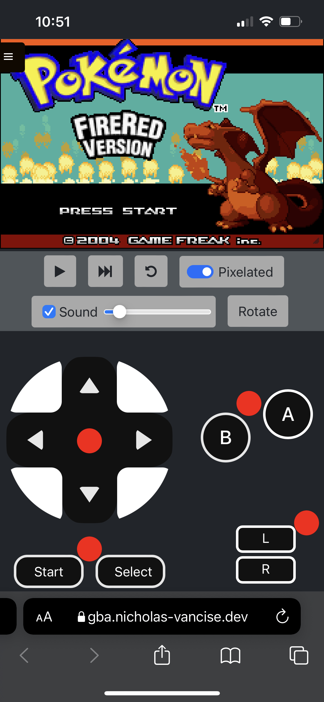

gbajs3 -- My Personal Fork
======

This project is a re-skin of the gbajs2 fork by andychase, with some additions.  

This project was driven specifically by my want to play older gba rom hacks outside of desktop applications without side loading or building through xcode.

A server side rendering approach is planned in the near future.

Use it online! <https://gba.nicholas-vancise.dev>

Do not attempt to log into the server unless you are the server owner, your IP may be banned.

## New Feature List
* Fast Forward
* Remappable Keyboard Bindings
* Virtual Controls (Desktop/Mobile)
* Movable desktop canvas and controls
* Mobile UI support

## To Do
* Mobile landscape css
* Cheat entry/injection implementation

## Sample Screenshots/Gifs

* Example Desktop



* Example Mobile



## Docker
* Requires an env file of the format:
```
ROM_PATH=./<local-server-rom-path>/
SAVE_PATH=./<local-server-save-path>/
CLIENT_HOST=https://<your-client-location>
```
* Remember to change gba-api.js to point to your servers domain
* Local builds on this branch expect certificates to be located in ./docker/server/auth/certs with the following structure/names:
```
./docker/server/auth/certs
├── certificate.crt
└── privateKey.key
```
* Golang api expects a sqlite file consisting of username/password pairs generated with bcrypt.GenerateFromPassword, as well as two uuid fields for token id's
* Simply run `docker-compose up --build` and your services will build and start

# -- (Original README below) --

gbajs2 is a Game Boy Advance emulator written in Javascript from scratch using HTML5 technologies like Canvas and Web Audio. 
It is freely licensed and works in any modern browser without plugins.

Use it online!

See the issues page for feature suggestions and ways you can help contribute!

Mailing list for general discussion or if you want to just be kept in the loop: ...

## Feature List

* Playable compatibility, see [compatibility](https://github.com/andychase/gbajs2/wiki/Compatibility-List)
* Acceptable performance on modern browsers
* Pure javascript, allowing easy API access
* Realtime clock gamepad support (Pokemon Ruby)
* Save games

## License
Original work by Endrift. Repo: (Archived / No longer maintained) https://github.com/endrift/gbajs

Copyright © 2012 – 2013, Jeffrey Pfau
Copyright © 2020, Andrew Chase

All rights reserved.

Redistribution and use in source and binary forms, with or without
modification, are permitted provided that the following conditions are met:

* Redistributions of source code must retain the above copyright notice, this
  list of conditions and the following disclaimer.

* Redistributions in binary form must reproduce the above copyright notice,
  this list of conditions and the following disclaimer in the documentation
  and/or other materials provided with the distribution.

THIS SOFTWARE IS PROVIDED BY THE COPYRIGHT HOLDERS AND CONTRIBUTORS "AS IS"
AND ANY EXPRESS OR IMPLIED WARRANTIES, INCLUDING, BUT NOT LIMITED TO, THE
IMPLIED WARRANTIES OF MERCHANTABILITY AND FITNESS FOR A PARTICULAR PURPOSE
ARE DISCLAIMED. IN NO EVENT SHALL THE COPYRIGHT HOLDER OR CONTRIBUTORS BE
LIABLE FOR ANY DIRECT, INDIRECT, INCIDENTAL, SPECIAL, EXEMPLARY, OR
CONSEQUENTIAL DAMAGES (INCLUDING, BUT NOT LIMITED TO, PROCUREMENT OF
SUBSTITUTE GOODS OR SERVICES; LOSS OF USE, DATA, OR PROFITS; OR BUSINESS
INTERRUPTION) HOWEVER CAUSED AND ON ANY THEORY OF LIABILITY, WHETHER IN
CONTRACT, STRICT LIABILITY, OR TORT (INCLUDING NEGLIGENCE OR OTHERWISE)
ARISING IN ANY WAY OUT OF THE USE OF THIS SOFTWARE, EVEN IF ADVISED OF THE
POSSIBILITY OF SUCH DAMAGE.
