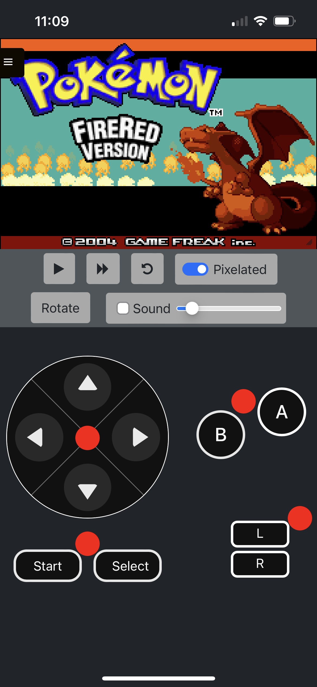
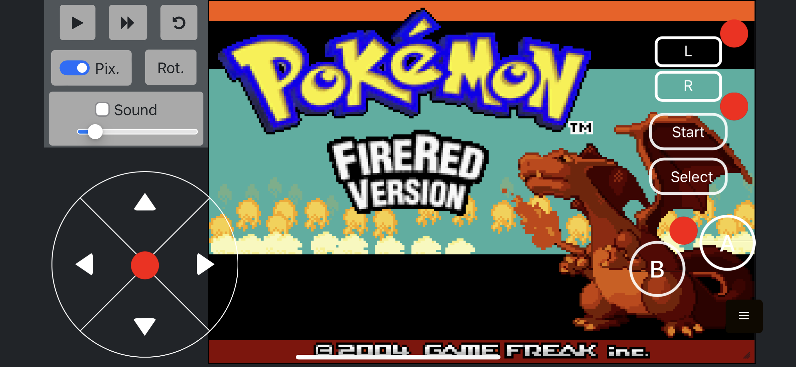

gbajs3 -- My Personal Fork
======

This project is a Game Boy Advance emulator that is freely licensed and works in any modern browser without plugins.

It began as a re-skin of the [gbajs2](https://github.com/andychase/gbajs2) fork by andychase, but now supports both the [mGBA wasm](https://github.com/thenick775/mgba/tree/feature/wasm) core as well as gbajs (a pure javascript GBA core).

This project was driven specifically by my need to play modern GBA rom hacks outside of desktop applications, without side loading or building through xcode.

Use it online! <https://gba.nicholas-vancise.dev>

Do not attempt to log into the server unless you are the server owner or an approved user, your IP may be banned.

## New Feature List
* Golang server for logged-in user support
* Nginx server for gbajs3 content
* Fast Forward
* Remappable Keyboard Bindings
* Virtual Controls (Desktop/Mobile)
* Movable desktop canvas and controls
* Mobile UI support
* Offline PWA Support
* Functional Surface-level ASM debugger (gbajs only)
* Interchangeable cores
    * mGBA support (wasm based)
    * gbajs support (pure javascript)

## Existing Feature List
- Both cores support realtime clock
- For additional gbajs2 features:
    - [Compatibility](https://github.com/andychase/gbajs2/wiki/Compatibility-List)
    - [Emulator features](https://github.com/andychase/gbajs2)
- For additional mGBA features:
    - [mGBA wasm fork Readme](https://github.com/thenick775/mgba/tree/feature/wasm)
    - [official mGBA Readme](https://github.com/mgba-emu/mgba)

## To Do
* Debugger enhancements
* Cheat entry/injection implementation
* mGBA Save State Support

## Sample Screenshots

* Example Desktop


* Example Mobile





## Docker
* Requires an env file of the format:
```
ROM_PATH=./<local-server-rom-path>/
SAVE_PATH=./<local-server-save-path>/
CLIENT_HOST=https://<your-client-location>
CERT_LOC=./<path to your certificate>
KEY_LOC=./<path to your key>
```
* Run `cp .env.example .env` for local builds, then adjust values or add certs/required directories
* Testing certificates can be created with:
```
openssl req -x509 -sha256 -nodes -days 365 -newkey rsa:2048 -keyout privateKey.key -out certificate.crt
```
* Golang api expects a sqlite file within the ./docker/server/auth directory consisting of username/password pairs generated with bcrypt.GenerateFromPassword, as well as two uuid fields for token id's
```
type User struct {
  Username  string
  PassHash  []byte
  TokenSlug uuid.UUID
  TokenID   uuid.UUID
}
```
* There is a helper script in ./docker/helper/users_db_helper.go that can be used to generate your initial database file. This will output a file of the name users.db.
```
go run users_db_helper.go
```
* Simply run `docker-compose up --build` and your services will build and start
* Golang api swagger UI can be found at `/api/documentation/`

## License
Original work by Endrift. Repo: (Archived / No longer maintained)
https://github.com/endrift/gbajs
Copyright © 2012 – 2013, Jeffrey Pfau

Original work by Endrift. Repo: (mGBA wasm base)
https://github.com/endrift/mgba
mGBA is Copyright © 2013 – 2018 Jeffrey Pfau. It is distributed under the [Mozilla Public License version 2.0](https://www.mozilla.org/MPL/2.0/). A full copy of the license is available at my [fork](https://github.com/thenick775/mgba).

Original work by andychase. Repo: (gbajs2 base)
https://github.com/andychase/gbajs2
Copyright © 2020, Andrew Chase 

Copyright © 2022 - 2023, Nicholas VanCise

All rights reserved.

Redistribution and use in source and binary forms, with or without
modification, are permitted provided that the following conditions are met:

* Redistributions of source code must retain the above copyright notice, this
  list of conditions and the following disclaimer.

* Redistributions in binary form must reproduce the above copyright notice,
  this list of conditions and the following disclaimer in the documentation
  and/or other materials provided with the distribution.

THIS SOFTWARE IS PROVIDED BY THE COPYRIGHT HOLDERS AND CONTRIBUTORS "AS IS"
AND ANY EXPRESS OR IMPLIED WARRANTIES, INCLUDING, BUT NOT LIMITED TO, THE
IMPLIED WARRANTIES OF MERCHANTABILITY AND FITNESS FOR A PARTICULAR PURPOSE
ARE DISCLAIMED. IN NO EVENT SHALL THE COPYRIGHT HOLDER OR CONTRIBUTORS BE
LIABLE FOR ANY DIRECT, INDIRECT, INCIDENTAL, SPECIAL, EXEMPLARY, OR
CONSEQUENTIAL DAMAGES (INCLUDING, BUT NOT LIMITED TO, PROCUREMENT OF
SUBSTITUTE GOODS OR SERVICES; LOSS OF USE, DATA, OR PROFITS; OR BUSINESS
INTERRUPTION) HOWEVER CAUSED AND ON ANY THEORY OF LIABILITY, WHETHER IN
CONTRACT, STRICT LIABILITY, OR TORT (INCLUDING NEGLIGENCE OR OTHERWISE)
ARISING IN ANY WAY OUT OF THE USE OF THIS SOFTWARE, EVEN IF ADVISED OF THE
POSSIBILITY OF SUCH DAMAGE.