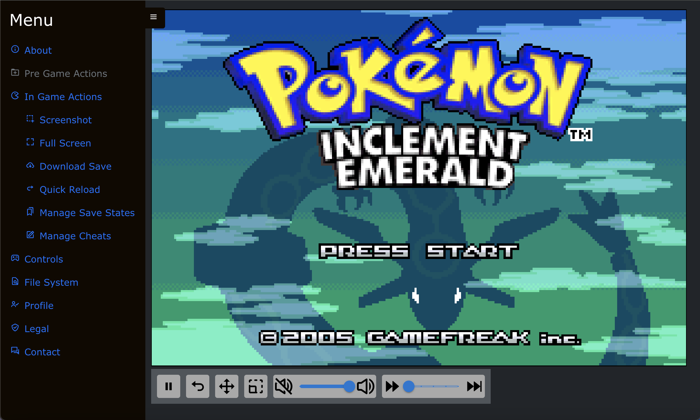
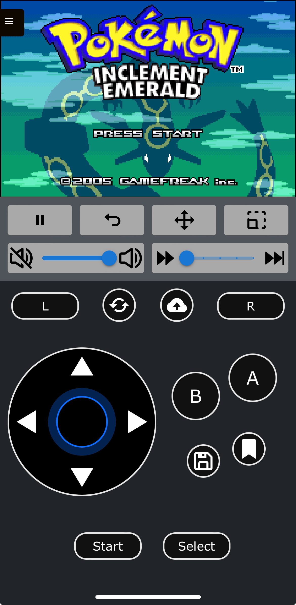

gbajs3 -- A Browser Based Game Boy Advance Emulator
======

This project is a Game Boy Advance emulator that is freely licensed and works in any modern browser without plugins.

It began as a re-skin of the [gbajs2](https://github.com/andychase/gbajs2) fork by andychase, but now supports the [mGBA wasm](https://github.com/thenick775/mgba/tree/feature/wasm) core through the use of emscripten, for a feature rich user experience.

This project was driven specifically by a need to play modern GBA rom hacks outside of desktop applications, without side loading or building through xcode. It is designed as an all-in-one mono repo containing the backend services and frontend services.

Use it online! <https://gba.nicholas-vancise.dev>

Note: legacy features are still available in the [v1 link](https://gba.nicholas-vancise.dev/v1/), you may need to clear your cookies to use v1.

Do not attempt to log into the server unless you are the server owner or an approved user, your IP may be banned.

## New Feature List
* Golang server for logged-in user support
* Nginx server for gbajs3 content
* Fast Forward
* Re-mappable Keyboard Bindings
* Virtual Controls (Desktop/Mobile)
* Movable desktop canvas and controls
* Mobile UI support
* Offline PWA Support
* ~~Functional Surface-level ASM debugger (gbajs only)~~ (available in legacy v1)
* Save state support
* Cheat code support
* Core Support
    * mGBA support (wasm based)
    * ~~gbajs support (pure javascript)~~ (available in legacy v1)
* Admin UI
* Postgres support
* Persistent file system utilizing IndexedDB
* Interactive Product Tour

## Existing Feature List
- Both cores support realtime clock
- For additional mGBA features and information:
    - [compatibility list](https://wiki.gbatemp.net/wiki/MGBA)
    - [mGBA wasm fork Readme](https://github.com/thenick775/mgba/tree/feature/wasm)
    - [official mGBA Readme](https://github.com/mgba-emu/mgba)
- ~~For additional gbajs2 features and information:~~ (available in legacy v1)
    - ~~[Compatibility](https://github.com/andychase/gbajs2/wiki/Compatibility-List)~~
    - ~~[Emulator features](https://github.com/andychase/gbajs2)~~

## To Do
* Debugger enhancements
* Server enhancements
    - request an account feature suite
    - s3 backed file storage
* SkyEmu secondary core (tentative)

## Sample Screenshots

* Example Desktop



* Example Mobile



* Example Admin


## Getting Started
* Local builds require [docker](https://www.docker.com)

* From the project root, navigate to the `docker` directory:
    ```
    cd ./docker;
    ```

* Copy the `.env.example` for local builds:
    ```
    cp .env.example .env;
    ```

* This will generate a `.env` file of the format:
    ```
    # gbajs3
    ROM_PATH=./<local server rom path>/
    SAVE_PATH=./<local server save path>/
    CLIENT_HOST=https://<your client location>
    CERT_DIR=./<path to your certificate root directory>
    CERT_LOC=./<path to your certificate>
    KEY_LOC=./<path to your key>

    # admin
    ADMIN_APP_ID=<your unique alphanumeric app id>

    # postgres
    PG_DB_HOST=<database host>
    PG_DB_USER=<databse user>
    PG_DB_PASSWORD=<databse user password>
    GBAJS_DB_NAME=<your gbajs3 database name, default `gbajs3`>
    ADMIN_DB_NAME=<your goadmin database name, default `goadmin`>
    PG_DB_PORT=<postgres db port, default 5432>
    PG_SSL_MODE=<pg ssl mode>
    PG_DATA_LOCATION=./<path to postgres persistent bind mount point>
    ```

    Leaving all default values in place will work for local development.

* Source this env file to get easy access to the default paths:
    ```
    source ./.env;
    ```

* Create configuration paths if they don't yet exist:
    ```
    mkdir $ROM_PATH;
    mkdir $SAVE_PATH;
    mkdir $CERT_DIR;
    ```

    The database mount directory will be created by the container with the correct permissions for your user.

* Generate test SSL certificates using your desired mechanism and move them to the default locations:

    Ex. [openssl](https://formulae.brew.sh/formula/openssl@1.1)
    ```
    openssl req -x509 -sha256 -nodes -days 365 -newkey rsa:2048 -keyout $KEY_LOC -out $CERT_LOC;
    ``` 

* If your developing on a mac, you will need to share the bind mount location(s) manually, and ensure they have the correct permissions

    These settings are located in `Settings -> Resources -> File Sharing`

* Build and run the docker containers:
    ```
    docker compose up --build;
    ``` 

* Once docker has created the containers, the web server will be available at https://localhost

* The Admin UI can be found at https://localhost/admin
    * The default password for all admin users is `admin`, **please log in to the admin portal and change the default passwords immediately**

* Golang api swagger UI can be found at https://localhost/api/documentation/

* To run each service individually without docker, see the nested READMEs under `./docker/server/`

## Contributing

Feel free to open discussions, issues, and pull requests. Contributions are welcome!

## License
Original work by Endrift. Repo: (Archived / No longer maintained)
https://github.com/endrift/gbajs
Copyright © 2012 – 2013, Jeffrey Pfau

Original work by Endrift. Repo: (mGBA wasm base)
https://github.com/endrift/mgba
mGBA is Copyright © 2013 – 2018 Jeffrey Pfau. It is distributed under the [Mozilla Public License version 2.0](https://www.mozilla.org/MPL/2.0/). A full copy of the license is available at my [fork](https://github.com/thenick775/mgba).

Original work by andychase. Repo: (gbajs2 base)
https://github.com/andychase/gbajs2
Copyright © 2020, Andrew Chase 

Copyright © 2022 - 2023, Nicholas VanCise

All rights reserved.

Redistribution and use in source and binary forms, with or without
modification, are permitted provided that the following conditions are met:

* Redistributions of source code must retain the above copyright notice, this
  list of conditions and the following disclaimer.

* Redistributions in binary form must reproduce the above copyright notice,
  this list of conditions and the following disclaimer in the documentation
  and/or other materials provided with the distribution.

THIS SOFTWARE IS PROVIDED BY THE COPYRIGHT HOLDERS AND CONTRIBUTORS "AS IS"
AND ANY EXPRESS OR IMPLIED WARRANTIES, INCLUDING, BUT NOT LIMITED TO, THE
IMPLIED WARRANTIES OF MERCHANTABILITY AND FITNESS FOR A PARTICULAR PURPOSE
ARE DISCLAIMED. IN NO EVENT SHALL THE COPYRIGHT HOLDER OR CONTRIBUTORS BE
LIABLE FOR ANY DIRECT, INDIRECT, INCIDENTAL, SPECIAL, EXEMPLARY, OR
CONSEQUENTIAL DAMAGES (INCLUDING, BUT NOT LIMITED TO, PROCUREMENT OF
SUBSTITUTE GOODS OR SERVICES; LOSS OF USE, DATA, OR PROFITS; OR BUSINESS
INTERRUPTION) HOWEVER CAUSED AND ON ANY THEORY OF LIABILITY, WHETHER IN
CONTRACT, STRICT LIABILITY, OR TORT (INCLUDING NEGLIGENCE OR OTHERWISE)
ARISING IN ANY WAY OUT OF THE USE OF THIS SOFTWARE, EVEN IF ADVISED OF THE
POSSIBILITY OF SUCH DAMAGE.
