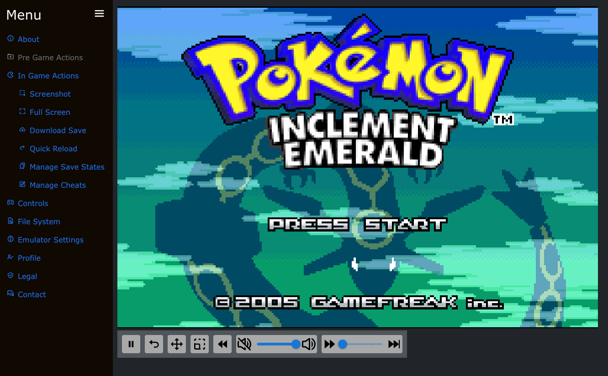
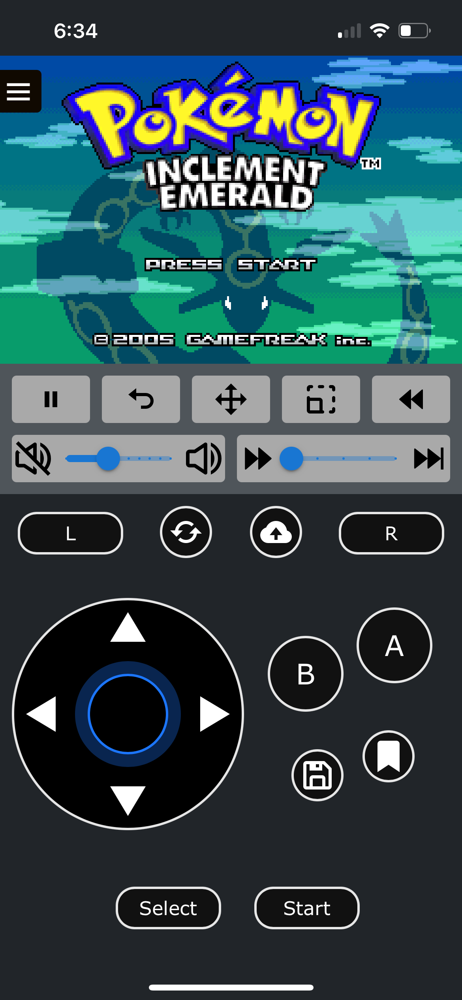
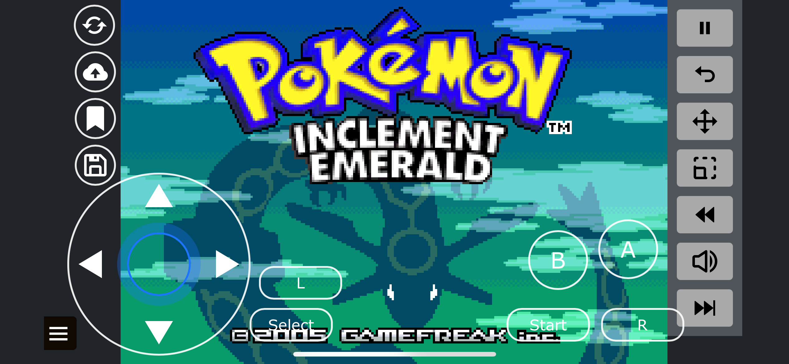
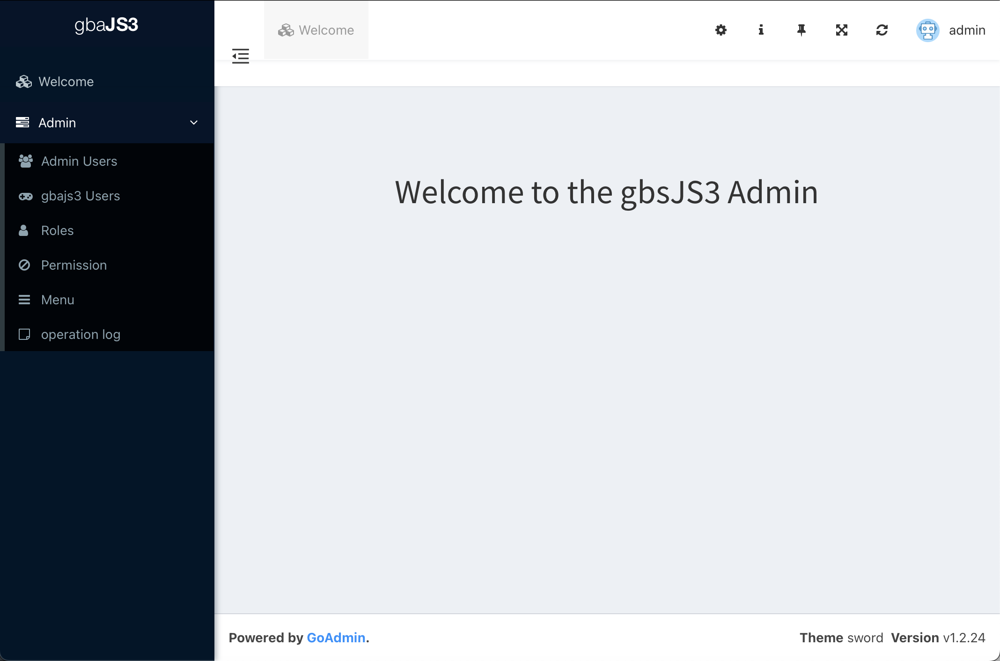

# gbajs3 -- A Browser Based Game Boy Advance Emulator

<div>
  <a href="https://github.com/thenick775/gbajs3/releases">
    
  </a>
  <a href="https://github.com/thenick775/gbajs3/actions">
    
  </a>
  <a href="https://github.com/thenick775/gbajs3/wiki">
    
  </a>
</div>

<br/>

This project is a Game Boy Advance emulator that is freely licensed and works in any modern browser without plugins.

It began as a re-skin of the [gbajs2](https://github.com/andychase/gbajs2) fork by andychase, but now supports the [mGBA wasm](https://github.com/thenick775/mgba/tree/feature/wasm) core through the use of emscripten, for a feature rich user experience.

This project was driven specifically by a need to play modern GBA rom hacks outside of desktop applications, without side loading or building through xcode. It is designed as an all-in-one mono repo containing the backend services and frontend services.

Use it online! <https://gba.nicholas-vancise.dev>

Do not attempt to log into the server unless you are the server owner or an approved user, your IP may be banned.

## New Feature List

- Golang server for logged-in user support
- Nginx server for gbajs3 content
- Fast Forward support
- Re-mappable keyboard bindings
- Virtual controls (Desktop/Mobile)
- Movable desktop canvas and controls
- Control profiles
- Mobile UI support
- Offline PWA support
- Save state support
- Auto save state support
- Cheat code support
- Soft patch support
- Rewind support
- Threading support
- Core support
  - mGBA (wasm based)
- Admin UI
- Postgres support
- Persistent file system utilizing IndexedDB
- Interactive product tour
- Load public rom files from query string

## Existing Feature List

- All cores support realtime clock
- For additional mGBA features and information:
  - [compatibility list](https://wiki.gbatemp.net/wiki/MGBA)
  - [mGBA wasm fork Readme](https://github.com/thenick775/mgba/tree/feature/wasm)
  - [official mGBA Readme](https://github.com/mgba-emu/mgba)

## To Do

- Debugger enhancements
- Server enhancements
  - request an account feature suite
  - s3 backed file storage
- Additional core support
  - NanoBoyAdvance (secondary core)
  - SkyEmu (secondary core)

## Sample Screenshots

- Example Desktop



- Example Mobile





All control positions can be modified if the default layouts do not suit your device!

- Example Admin



## Getting Started

- Local builds require [docker](https://www.docker.com)

- Run the bootstrap script and follow the interactive prompts:

  ```
  ./bin/boostrap.sh;
  ```

- The bootstrap script will do the following:

  - copy env files from the examples in all directories
  - create default local directories
  - generate a local test ssl certificate pair with prompting from OpenSSL (if installed)

- This script will also generate a top level `.env` file of the following format, merging all service specific env files and additional docker config:

  ```
  # gbajs3
  ROM_PATH=./<local server rom path>/
  SAVE_PATH=./<local server save path>/
  CLIENT_HOST=https://<your client location>
  CERT_DIR=./<path to your certificate root directory>
  CERT_LOC=./<path to your certificate>
  KEY_LOC=./<path to your key>

  # admin
  ADMIN_APP_ID=<your unique alphanumeric app id>

  # postgres
  PG_DB_HOST=<database host>
  PG_DB_USER=<database user>
  PG_DB_PASSWORD=<database user password>
  GBAJS_DB_NAME=<your gbajs3 database name, default `gbajs3`>
  ADMIN_DB_NAME=<your goadmin database name, default `goadmin`>
  PG_DB_PORT=<postgres db port, default 5432>
  PG_SSL_MODE=<pg ssl mode>
  PG_DATA_LOCATION=./<path to postgres persistent bind mount point>

  # compose for merging yaml definitions
  COMPOSE_FILE_SEPARATOR=:
  COMPOSE_FILE=<colon separated list of compose files to merge>
  SERVICE_POSTGRES=<relative path of postgres service>
  SERVICE_GBAJS3=<relative path of gbajs3 service>
  SERVICE_AUTH=<relative path of auth service>
  SERVICE_ADMIN=<relative path of admin service>
  ```

  Leaving all default values in place will work for local development.

- If your developing on a mac, you will need to share the database bind mount location(s) manually, and ensure they have the correct permissions

  These settings are located in `Settings -> Resources -> File Sharing`

- Build and run the docker containers using compose:

  ```
  docker compose up;
  ```

- Build and run the docker containers using swarm:

  ```
  # swarm does not build images by default
  docker compose build;
  # add all images to the stack except shepherd for local dev
  docker stack deploy -c docker-compose.swarm.yaml -c ./auth/docker-compose.yaml -c ./admin/docker-compose.yaml -c ./postgres/docker-compose.yaml -c ./gbajs3/docker-compose.yaml gbajs3;
  ```

- Once docker has created the containers, the web server will be available at https://localhost

- The Admin UI can be found at https://localhost/admin

  - The default password for all admin users is `admin`, **please log in to the admin portal and change the default passwords immediately**

- Golang api swagger UI can be found at https://localhost/api/documentation/

- To run each service individually, with or without docker, see the nested READMEs under each top level service directory

## Contributing

Feel free to open discussions, issues, and pull requests. Contributions are welcome!

## License

Original work by Endrift. Repo: (Archived / No longer maintained)
https://github.com/endrift/gbajs
Copyright © 2012 – 2013, Jeffrey Pfau

Original work by Endrift. Repo: (mGBA wasm base)
https://github.com/endrift/mgba
mGBA is Copyright © 2013 – 2018 Jeffrey Pfau. It is distributed under the [Mozilla Public License version 2.0](https://www.mozilla.org/MPL/2.0/). A full copy of the license is available at my [fork](https://github.com/thenick775/mgba).

Original work by andychase. Repo: (gbajs2 base)
https://github.com/andychase/gbajs2
Copyright © 2020, Andrew Chase

Copyright © 2022 - 2025, Nicholas VanCise

All rights reserved.

Redistribution and use in source and binary forms, with or without
modification, are permitted provided that the following conditions are met:

- Redistributions of source code must retain the above copyright notice, this
  list of conditions and the following disclaimer.

- Redistributions in binary form must reproduce the above copyright notice,
  this list of conditions and the following disclaimer in the documentation
  and/or other materials provided with the distribution.

THIS SOFTWARE IS PROVIDED BY THE COPYRIGHT HOLDERS AND CONTRIBUTORS "AS IS"
AND ANY EXPRESS OR IMPLIED WARRANTIES, INCLUDING, BUT NOT LIMITED TO, THE
IMPLIED WARRANTIES OF MERCHANTABILITY AND FITNESS FOR A PARTICULAR PURPOSE
ARE DISCLAIMED. IN NO EVENT SHALL THE COPYRIGHT HOLDER OR CONTRIBUTORS BE
LIABLE FOR ANY DIRECT, INDIRECT, INCIDENTAL, SPECIAL, EXEMPLARY, OR
CONSEQUENTIAL DAMAGES (INCLUDING, BUT NOT LIMITED TO, PROCUREMENT OF
SUBSTITUTE GOODS OR SERVICES; LOSS OF USE, DATA, OR PROFITS; OR BUSINESS
INTERRUPTION) HOWEVER CAUSED AND ON ANY THEORY OF LIABILITY, WHETHER IN
CONTRACT, STRICT LIABILITY, OR TORT (INCLUDING NEGLIGENCE OR OTHERWISE)
ARISING IN ANY WAY OUT OF THE USE OF THIS SOFTWARE, EVEN IF ADVISED OF THE
POSSIBILITY OF SUCH DAMAGE.
